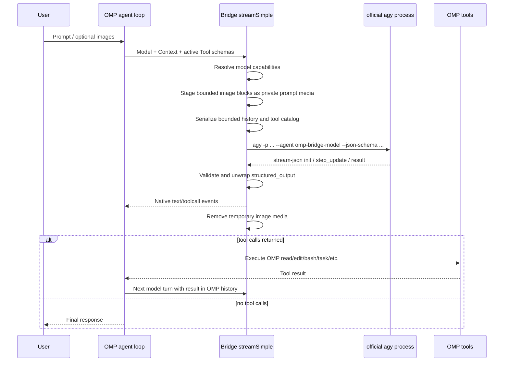

# Architecture

## Goal

Use the **official** Antigravity CLI for authentication and model access while preserving OMP as the primary coding harness.

A shell wrapper around `agy` normally creates this undesirable structure:

```text
OMP agent → Antigravity agent → Antigravity tools
```

That makes OMP blind to inner tool calls, edits, permissions, and subagents. The provider path in this package changes the boundary:

```text
OMP agent → tool-less Antigravity model shim → structured OMP tool calls
```

## Two execution modes

### Mode A: provider mode

Provider ID:

```text
official-agy
```

Custom API ID:

```text
official-agy-cli-v1
```

The API ID is deliberately unique. Reusing an existing API ID can replace a global stream handler and accidentally route unrelated providers through this extension.

Sequence:



### Mode B: delegate tool

Tool name:

```text
agy_delegate
```

Sequence:

```text
OMP model
  → calls agy_delegate
  → bridge launches normal official agy agent
  → Antigravity may use its own tools and subagents
  → bridge surfaces progress summaries through onUpdate
  → final Antigravity response becomes one OMP tool result
```

This mode is useful, but it is not native model integration.

## State authority

### OMP owns

- canonical message history;
- branch/tree semantics;
- compaction and context rewriting;
- image blocks and attachment ordering;
- tool selection and argument validation;
- tool results;
- OMP subagent lifecycle;
- workspace isolation and patch merging;
- user-visible edit/tool cards;
- retries caused by OMP tool errors.

### `agy` owns

- official account/keyring authentication;
- model selection under `--model`;
- one headless inference run;
- model interpretation of explicitly attached prompt media;
- Antigravity usage metadata and terminal status.

### Why provider mode is stateless

Provider mode does not pass `--continue` or `--conversation`.

That is intentional. An Antigravity conversation ID cannot faithfully represent:

- OMP branch rewinds;
- OMP context compaction;
- changed active tools;
- OMP-injected tool results;
- child OMP subagent sessions;
- model switching between OMP roles.

Every provider call therefore sends a bounded reconstruction of OMP's current context. This costs more input tokens and process startup time, but it avoids split-brain state. Images retained in that context are restaged for each stateless call.

Delegate mode may resume an explicit Antigravity `conversation_id`, because the nested Antigravity conversation is itself the delegated unit of state.

## Tool translation

The bridge reads `Context.tools` from OMP and serializes:

```json
{
  "name": "read",
  "description": "...",
  "parameters": {
    "type": "object",
    "properties": {}
  }
}
```

The terminal Antigravity result is constrained to:

```json
{
  "text": "",
  "tool_calls": [
    {
      "name": "read",
      "arguments": { "path": "src/index.ts" }
    }
  ],
  "finish_reason": "tool_use"
}
```

The extension converts each entry into OMP's native `ToolCall` block and emits:

```text
start
toolcall_start
toolcall_delta
toolcall_end
done(reason=toolUse)
```

OMP validates and executes the call. Invalid arguments are not executed silently; they enter OMP's normal tool-error loop.

Some AGY runs return a valid outer bridge object whose `text` itself contains another serialized bridge object. Provider mode recursively unwraps only bridge-shaped nested output, validates its tool names, and leaves ordinary JSON examples untouched.

## Image translation

OMP decides whether a model can be used for `inspect_image` from the registered model's `input` array. The bridge maps explicit Gemini logical models, `supportsImages: true`, and `capabilities.image: true` to:

```json
{
  "input": ["text", "image"]
}
```

The raw OMP image block is not placed into the textual history. Instead:

1. `media.ts` scans image blocks in canonical message order.
2. It validates supported media types, count, aggregate decoded size, and base64/binary shape.
3. It writes mode-`0600` files under a fresh mode-`0700` `.omp-agy-media-*` directory in the request workspace.
4. `messages.ts` replaces each raw image with a numbered `image_attachment` placeholder.
5. `prompt.ts` adds matching AGY `@./...` file mentions under a dedicated prompt-media section.
6. The tool-less bridge agent may interpret only those explicit media attachments; it still cannot invoke file tools.
7. Provider cleanup removes the directory after success, failure, or cancellation.

`official-agy/auto` is not inferred as multimodal because provider registration cannot know the account-selected model behind it. It must be explicitly marked when the operator knows that route is image-capable.

## OMP subagents

The bridge does not recreate OMP subagents. It exposes the real OMP `task` tool in the model's tool catalog.

When Gemini requests `task`:

1. OMP executes its normal task implementation.
2. OMP creates child sessions with their own context and tool sets.
3. Each child resolves its configured OMP model role.
4. A child using `official-agy/*` creates an independent official `agy` process per model turn.
5. Results return through the existing OMP `task` artifact/progress system.

Configure the `task`, `smol`, `vision`, or other roles explicitly. Selecting `official-agy` only for the parent does not guarantee every OMP child or one-shot role uses it.

## Concurrency

Two independent limits matter:

```text
OMP task.maxConcurrency
bridge maxConcurrent
```

The bridge semaphore is process-local and shared between provider calls and `agy_delegate` calls from the extension instance. Start with three. Raising OMP task concurrency above the bridge limit only creates queued child model requests.

A future production implementation should add a cross-process lock because multiple OMP processes can otherwise each launch up to the local bridge limit.

## Stream behavior

`agy --output-format stream-json` provides incremental NDJSON events. However, `--json-schema` applies to the terminal result, not to a native incremental function-call protocol.

Provider mode therefore:

- parses progress events for diagnostics;
- waits for terminal `structured_output`;
- emits the validated text/tool calls as OMP events after completion.

This is event-compatible but not true token-by-token response streaming.

Delegate mode can display incremental `agent_response`, tool, and subagent summaries because its response is not being repurposed as an OMP function-call envelope.

## Process boundary

Each provider turn:

1. resolves the logical model and its image capability;
2. validates and stages any OMP image inputs inside the request workspace;
3. writes a temporary response schema;
4. passes the reconstructed prompt using `agy -p <prompt>`;
5. ignores stdin so the child cannot stall waiting for input;
6. parses only stdout NDJSON;
7. retains bounded stderr diagnostics;
8. forwards cancellation with `SIGTERM`, then `SIGKILL` after a grace period;
9. requires exactly one terminal `result` event with `status: SUCCESS`;
10. deletes the schema directory and staged image directory.

## Why there is no arbitrary OMP tool RPC

OMP's extension API exposes provider registration and tool registration, but does not expose a generic supported `pi.callTool(name, args)` method for an external process.

Consequently, a pure extension cannot receive an arbitrary Antigravity tool request and synchronously invoke any active OMP tool by name. This package instead uses the model-provider protocol: return a native OMP `ToolCall`, then let OMP's own agent loop dispatch it.

A deeper hybrid would require one of:

- an OMP core API for programmatic tool dispatch;
- an OMP RPC/ACP bridge that exposes the active tool registry;
- an MCP server that faithfully proxies selected OMP tools;
- a core provider implementation instead of an extension.

Do not fake this by shelling out to `omp` recursively for every tool call. That creates nested sessions, duplicated locks, broken approvals, and incoherent histories.
